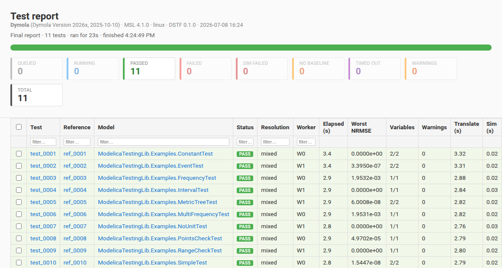

# Dynamic Systems Testing Framework (DSTF)

[](https://github.com/ORNL-Modelica/DynamicSystemsTestingFramework/actions/workflows/quality.yml)

Regression and unit testing for time-dependent system behavior. Discovers tests, runs simulations, compares against versioned baselines, and reports — across **Modelica (Dymola, OpenModelica), FMU (FMPy), Julia/ModelingToolkit, and arbitrary Python**.

Library-agnostic: tests can be discovered from in-model annotations (`UnitTests` components), declarative `test_spec.json`, or both. Reference results are partitioned per backend / OS so the same library can be regression-tested across simulators without ref drift.



*The unified dashboard — live progress during a run, a static report after. Each report is stamped with the backend, tool + MSL version, and OS that produced it; the table gives per-test verdicts, worst-NRMSE, and phase timing.*

## What's in the box

- **5 simulator backends**, each with persistent-worker support where it pays off:

  | Backend | Source kind | Persistent | Notes |
  |---|---|---|---|
  | Dymola | Modelica `.mo` | ✓ default | Python interface; falls back to batched `.mos` |
  | OpenModelica | Modelica `.mo` | ✓ default | OMPython ZMQ; falls back to `omc -s` |
  | FMPy | Pre-built FMU | per-test thread | `fmpy.simulate_fmu` in-process |
  | Julia / MTK | `.jl` ModelingToolkit | ✓ default | stdin-JSON pipe; Dyad untested |
  | Python | Any `simulate(stop_time, tol) -> dict` | subprocess-per-test | scipy, pandas, CSV loader, HTTP — anything |

- **6 comparison modes**, composable via a `MetricTree`:

  | Mode | What it scores |
  |---|---|
  | `nrmse` | RMSE over signal range — the default |
  | `tube` | Pass if signal stays inside a (constant or time-varying) envelope around ref |
  | `points` | Per-point checks at declared times with `time_tolerance` x-box and abs/rel y-tolerance |
  | `range` | Scalar `min_value` / `max_value` bounds — baseline-free |
  | `event-timing` | Match Modelica solver events against a declared list within per-event tolerance |
  | `dominant-frequency` | FFT peak matching against a declared peaks table — windowable |

  Combinators: `and`, `or`, `k-of-n`, `warn` (relax to advisory), `weighted`. Leaves can scope to a time window and target named baselines (`primary`, soft-checks, companions).

- **Reporter as IDE** — interactive Plotly HTML with live per-leaf re-scoring on edit, structural tree editing, shape-drag tube/range/peak/points-box editors, and RFC 6902 JSON-Patch export round-tripped via `dstf spec-update`. Plus live dashboard during runs and JUnit XML for CI.

- **Three baseline roles** per test, partitioned on disk: **primary** (regression anchor, hard-fail), **soft_checks** (warn-wrapped cross-regression imports), **companions** (plot-only overlays, including cross-library).

## Install

End users:

```bash
uv tool install dstf       # then run plain: dstf ...
# or: pipx install dstf
```

Developers:

```bash
uv pip install -e ".[dev]"             # core + pytest
uv pip install -e ".[dev,fmpy,om]"     # plus FMPy + OpenModelica extras
uv run dstf --help
```

For the Julia backend, install Julia 1.11+ and instantiate the demo project once:

```bash
curl -fsSL https://install.julialang.org | sh -s -- -y --default-channel 1.11
cd examples/julia/JuliaMtkTestingLib && julia --project=. -e 'using Pkg; Pkg.instantiate()'
```

For the Python `SimpleRamp` example: `uv pip install scipy`.

## First 5 minutes

The repo ships demo libraries for every backend. Easiest first run is the Modelica demo:

```bash
# From the repo root:
uv run dstf --config examples/modelica/ModelicaTestingLib/Resources/ReferenceResults/testing.json run
```

What this does:

1. Reads `testing.json` to find the demo library, the simulator (Dymola or OpenModelica — first one whose binary exists wins), the reference root, and any per-test recognizers.
2. Discovers the demo tests via the bundled `UnitTests` recognizer plus declarative recognizers in the JSON.
3. Runs each in a persistent simulator worker, partitioning output under `testing_output/` by backend + OS.
4. Compares against `Resources/ReferenceResults/<Backend>/<os>/ref_NNNN.json` baselines.
5. Prints a console report with pass/fail per test.

To see the interactive HTML reporter:

```bash
uv run dstf --config examples/modelica/ModelicaTestingLib/Resources/ReferenceResults/testing.json run --report ./reports
```

The dashboard URL is printed when a parallel run starts (`--parallel N`); auto-refreshes every 2s.

To repeat with another backend's demo library, swap the config path:

```bash
# OpenModelica or Dymola, depending on which binaries the demo finds
uv run dstf --config examples/julia/JuliaMtkTestingLib/Resources/ReferenceResults/testing.json run
uv run dstf --config examples/python/PythonTestingLib/Resources/ReferenceResults/testing.json run
uv run dstf --config examples/fmu/testing.json run    # needs reference-fmus-binaries/
```

## Configuration cheat-sheet

`testing.json` is the single entry point. The full field reference lives in `docs/usage.md`; the headline shape:

```json
{
  "source_path": "../../MyLib",
  "simulators": {
    "Dymola":       ["C:\\Program Files\\Dymola 2026x\\bin64\\Dymola.exe"],
    "OpenModelica": ["/usr/bin/omc"]
  },
  "test_spec": "test_spec.json",
  "dependencies": ["/path/to/SomeDep"],
  "tolerance": 1e-4,
  "diagnostic_variables": ["CPUtime", "EventCounter"]
}
```

The first `simulators` entry whose binary exists wins (no need for per-OS config files). `simulator: "Dymola"` (or any named entry) forces a specific one.

## Common commands

```bash
# Discover tests without running
uv run dstf --config testing.json discover

# Run, compare, accept all current results as new baselines
uv run dstf --config testing.json run --accept

# Interactive review by category
uv run dstf --config testing.json run -i failed

# Filter (glob, comma list, or @file)
uv run dstf --config testing.json run --filter "Foo.A,Foo.B"
uv run dstf --config testing.json run --filter @rerun.txt

# Parallel + small-batch dispatch + interactive HTML report
uv run dstf --config testing.json run --parallel 4 --batch-size 3 --report ./reports

# Rerun only previously-failed tests, merge with last full run, regen report
uv run dstf --config testing.json run --rerun failed,sim-failed --merge --report

# Compare without re-simulating (uses last results)
uv run dstf --config testing.json compare

# Apply an RFC 6902 JSON-Patch exported from the interactive report
uv run dstf --config testing.json spec-update spec_patch.json

# Manage the other baseline roles
uv run dstf --config testing.json companion add <model> <name> <path>
uv run dstf --config testing.json soft-check list <model>
uv run dstf --config testing.json import-baseline <model> <role> <name> <source>

# Manifest / schema
uv run dstf --config testing.json manifest dump
uv run dstf --config testing.json manifest cleanup --orphans [--apply]
uv run dstf --config testing.json export-schema --output schema.json

# Diagnose Dymola Python interface discovery
uv run dstf check-dymola
```

`uv run dstf <command> --help` for each subcommand's full flag set.

## Where things live

| Doc | What's in it |
|---|---|
| `docs/usage.md` | The deep user guide — every command, every config field, every comparison mode |
| `docs/architecture.md` | Six-layer plug-in pipeline + current-state map to code |
| `docs/extensibility.md` | Plug-in contracts for Source / Discovery / Backend / Dataset / Metric / Combinator |
| `docs/vision.md` | Where the framework is going (target user base, non-Modelica futures) |
| `docs/decisions.md` | Authoritative decision log |
| `docs/ideas.md` | Backlog (unimplemented features, with explicit deferred-by-design entries) |
| `examples/{modelica,fmu,julia,python}/` | Working demo libraries — one per backend |

## CI integration

```yaml
- run: |
    uv run dstf --config ./testing.json run --report-format junit --output test-results.xml
- uses: actions/upload-artifact@v4
  with:
    name: test-results
    path: test-results.xml
```

For HTML reports as build artifacts, also pass `--report ./reports` and upload the `reports/` directory.

## Status

5 simulator backends in production, 3 demo libraries, and a comprehensive pytest suite (a Playwright subset covers the interactive report). The reporter-as-IDE is feature-complete: per-leaf live scoring plus shift-click/drag editors for tube / point / range / peak criteria.
